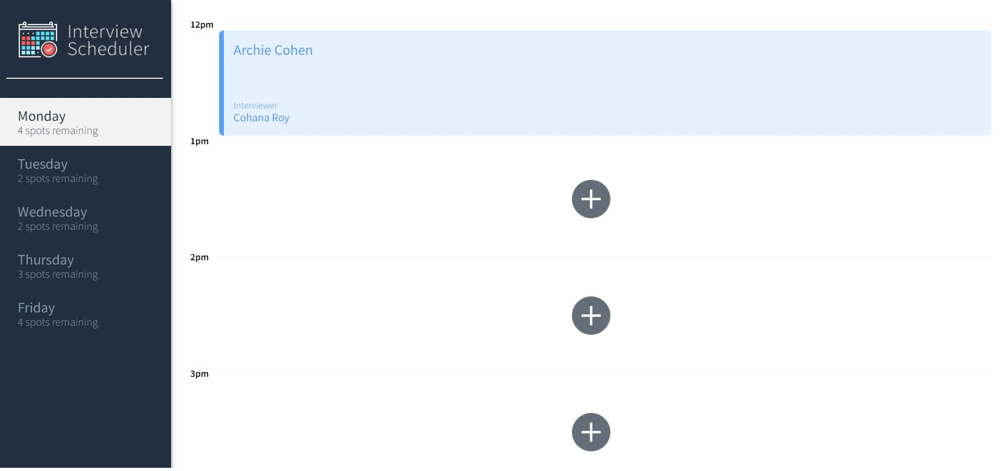
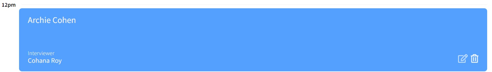
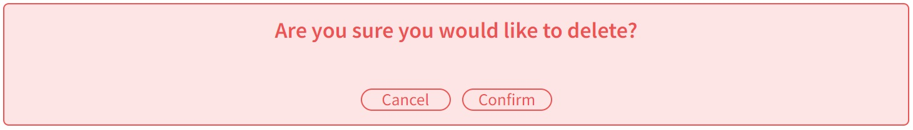
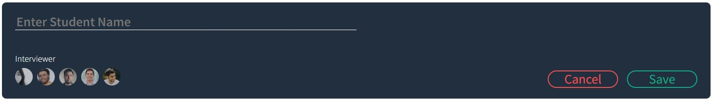

# Interview Scheduler

### Functional Requirements
* Development focuses on a single page application (SPA) called Interview Scheduler, built using React.
* Data is persisted by the API server using a PostgreSQL database.
* The client application communicates with an API server over HTTP, using the JSON format.
* Jest tests are used through the development of the project.

### Behavioural Requirements
* Interviews can be booked between Monday and Friday.
* A user can switch between weekdays.
* A user can book an interview in an empty appointment slot.
* Interviews are booked by typing in a student name and clicking on an interviewer from a list of available interviewers.
* A user can cancel an existing interview.
* A user can edit the details of an existing interview.
* The list of days informs the user how many slots are available for each day.
* The expected day updates the number of spots available when an interview is booked or canceled.
* A user is presented with a confirmation when they attempt to cancel an interview.
* A user is shown an error if an interview cannot be saved or deleted.
* A user is shown a status indicator while asynchronous operations are in progress.
* When the user presses the close button of the error they are returned to the Form or Show view (skipping Status and Confirm).
* The application makes API requests to load and persist data. We do not lose data after a browser refresh.

### Technical Specifications
* React
* Webpack, Babel
* Axios
* Storybook, Webpack Dev Server, Jest, Testing Library, Cypress
- The Scheduler client application is created using Create React App. 
- Express is the basis for the Scheduler API server application.
- Both servers run concurrently; requests are proxied from the Webpack development server to the API server.

## Screenshots (click image thumbnail for full size)

<table>
  <tr>
    <th> Description </th>
    <th> Image Thumbnail </th>
  </tr>
  <tr>
    <td>
      The main screen of the scheduler app:
    </td>
    <td style="text-align: center">
      <a href="https://https://github.com/JeremyWallace1/scheduler/tree/master/images/screenshot1.jpg"></a>
    </td>
  </tr>
  <tr>
    <td>
      A selected appointment:
    </td>
    <td style="text-align: center">
      <a href="https://https://github.com/JeremyWallace1/scheduler/tree/master/images/screenshot2.jpg"></a>
    </td>
  </tr>
  <tr>
    <td>
      Confirmation screen:
    </td>
    <td style="text-align: center">
      <a href="https://https://github.com/JeremyWallace1/scheduler/tree/master/images/screenshot3.jpg"></a>
    </td>
  </tr>
  <tr>
    <td>
      Deleting screen:
    </td>
    <td style="text-align: center">
      <a href="https://https://github.com/JeremyWallace1/scheduler/tree/master/images/screenshot4.jpg"></a>
    </td>
  </tr>
  <tr>
    <td>
      Creating New Appointment:
    </td>
    <td style="text-align: center">
      <a href="https://https://github.com/JeremyWallace1/scheduler/tree/master/images/screenshot5.jpg"></a>
    </td>
  </tr>
  <tr>
    <td>
      Creating New Appointment:
    </td>
    <td style="text-align: center">
      <a href="https://https://github.com/JeremyWallace1/scheduler/tree/master/images/screenshot5.jpg"></a>
    </td>
  </tr>
</table>

## Setup

Install dependencies with `npm install`.

## Running Webpack Development Server

```sh
npm start
```

## Running Jest Test Framework

```sh
npm test
```

## Running Storybook Visual Testbed

```sh
npm run storybook
```

## Getting Started
1. Create the `.env.development` by using `.env.example` as a reference: `cp .env.example .env.development`
2. Install dependencies: `npm i`
3. Fork and clone the scheduler-api (`https://github.com/lighthouse-labs/scheduler-api`) into a NEW DIRECTORY
4. Follow the README.md instructions for scheduler-api
5. With api running, then 'npm start' in scheduler (not the api) to start the web server
6. Visit `http://localhost:8080/` (should open automatically)

## Warnings & Tips
  - use `http://localhost:8001/api/debug/reset` to reset the database

## Dependencies
* "axios": "^0.20.0",
* "classnames": "^2.2.6",
* "normalize.css": "^8.0.1",
* "react": "^16.9.0",
* "react-dom": "^16.9.0",
* "react-scripts": "3.4.4"

## devDependencies
* "@babel/core": "^7.4.3",
* "@storybook/addon-actions": "^5.0.10",
* "@storybook/addon-backgrounds": "^5.0.10",
* "@storybook/addon-links": "^5.0.10",
* "@storybook/addons": "^5.0.10",
* "@storybook/react": "^5.0.10",
* "@testing-library/jest-dom": "^4.0.0",
* "@testing-library/react": "^8.0.7",
* "@testing-library/react-hooks": "^8.0.1",
* "babel-loader": "8.1.0",
* "prop-types": "^15.8.1",
* "react-test-renderer": "^16.9.0",
* "sass": "^1.53.0"